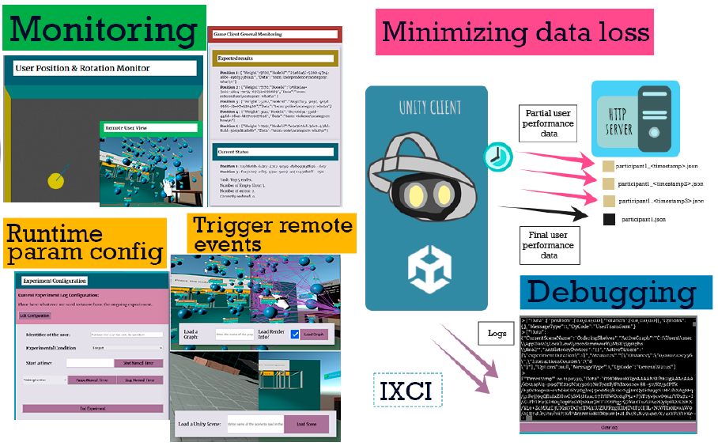
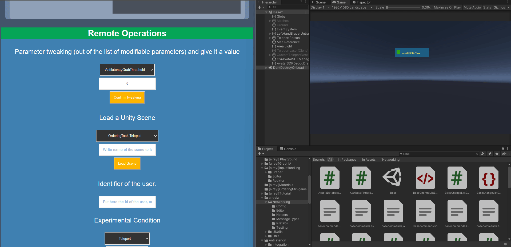

# The Immersive eXperimenter Control Interface

IXCI is a toolkit targeted at HCI researchers that consists of a set of components that provide them with a (web-based)
visual interface to control and monitor immersive applications. It aims to provide readily available functionality that
supports researchers in the process of designing/prototyping a virtual scenario, testing and ultimately experiment
execution.

The control panel interface acts as monitor/control panel for the researcher who can : keep track of the user position
and gaze within the virtual environment; execute a set of ah-hoc functions concerning the experiment (through forms and
buttons); manage configuration parameters to be applied in the VR application; and, display remote log messages via a
terminal window.


Cite our work:

> [A Tool for Monitoring and Controlling Standalone Immersive HCI Experiments](https://dl.acm.org/doi/10.1145/3474349.3480217)
<pre> @inproceedings{
    rey2021tool,
    title={A Tool for Monitoring and Controlling Standalone Immersive HCI Experiments},
    author={Rey, Alejandro and Bellucci, Andrea and Diaz, Paloma and Aedo, Ignacio},
    booktitle={The Adjunct Publication of the 34th Annual ACM Symposium on User Interface Software and Technology},
    pages={20--22},
    year={2021}
} </pre>





# System Architecture


# Showoff
Remote call example

Switching between scenes

Monitoring position and user view (we're sending frames not too often by now)


# Ongoing work
- Making the Unity components available as a Unity package, it'll be out very soon (almost done)
- Integration with gRPC (for network infrastructure automation) to further make the system more flexible (We're testing it!)
- GUI to enable the creation of new remote control/monitoring commands (We're testing it!)


#Builds
**Available very soon!**

#Dependencies
**Work in Progress**

Json.NET 12.0.3 for Unity
https://github.com/jilleJr/Newtonsoft.Json-for-Unity

Name: jilleJr
URL: https://npm.cloudsmith.io/jillejr/newtonsoft-json-for-unity
Scope(s): jillejr.newtonsoft.json-for-unity

Json.NET Converters of Unity types
Version 1.4.0 - February 05, 2022


#Installation : using IXCI

Work in progress

[comment]: <> (```shell)

[comment]: <> ($ git clone https://github.com/username/reponame && cd reponame)

[comment]: <> ($ npm install)

[comment]: <> (```)